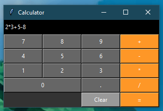
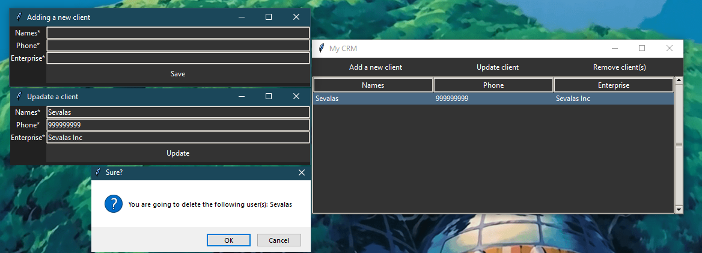
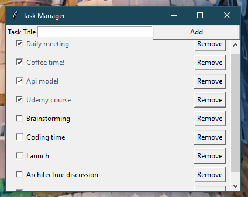
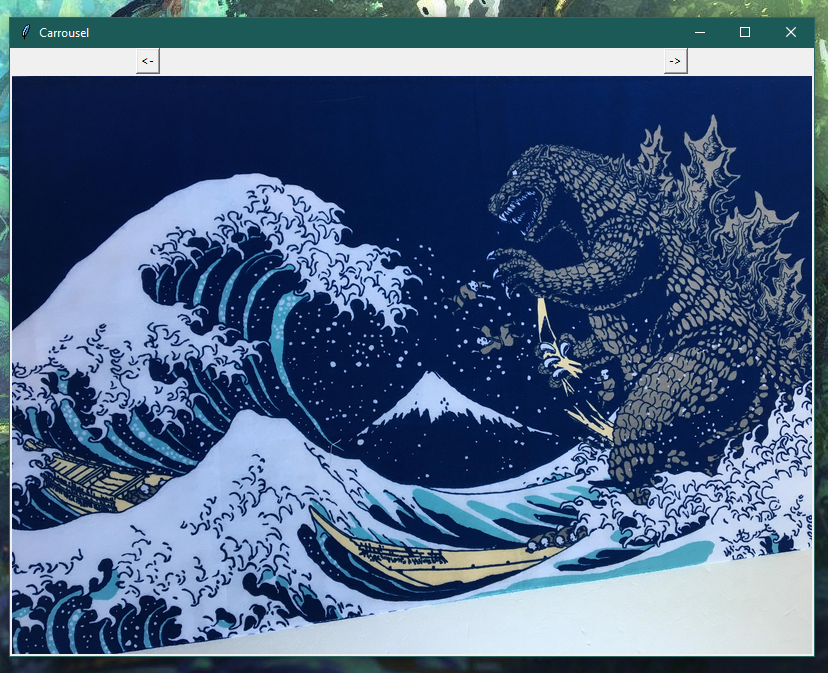

# tkinter-apps

Hello! This repository contains some tkinter projects with which I have learned how to create windows applications in python.

You can find executables compiled with pyinstaller in the ["executables"](./executables) folder, you can also find the code ready to be modified and compiled by yourself in the folder ["code"](./code).

The applications you will find are: 
* Calculator with "iOS'' style:

  

* Client register manager:

  

* TaskManager:

  

* Image Carrousel:

  # tkinter-apps